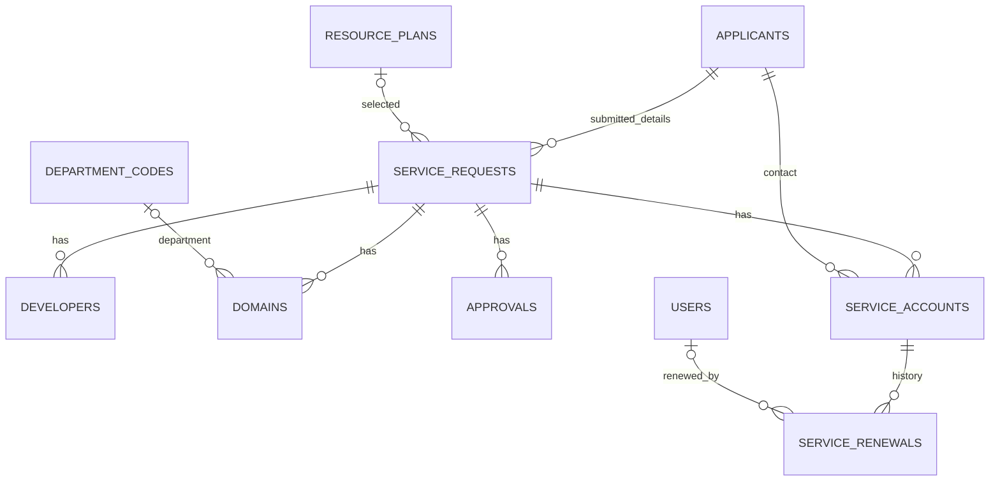

# ??????????????????????????

??????? migrations ??? Models ????????????? 10 ??????? 2569 ?????? SQL dump ????????????? ??????????????????????? foreign key ???????????????? `database/migrations` ????????

## ??????????????????

| ????? | Primary key | ??????? |
|---|---|---|
| users | id | ???????????????? ???? ????? password hash ??? is_active |
| password_reset_tokens | email | token ???????????????????????????? |
| applicants | applicant_id | ??????????? ? ????????????????????????? |
| service_requests | request_id | ???? ???????????? ?????????? ????? ??????????????????????? |
| developers | developer_id | ???????????????????????????? |
| resource_plans | plan_id | ??????? Web Hosting / Virtual Server ?????????????? |
| department_codes | code | ????????????????????????????? |
| domains | domain_id | ????????????????????????? |
| approvals | approval_id | ???????????????????????????????????? |
| service_accounts | account_id | ????????????????????? ?????????????? Plesk |
| service_renewals | id | ?????????????????????? |
| failed_jobs | id | ????? framework ???????? workflow ??? Hosting ?????? queue |

## ????????????

????????????????????? applicant ??????? ??????????????????????? ???????????????????????????????????????? ??????????????????????? ????????????????? applicants ??????????????????????? ?????????????????????? applicant ??????????????? ????????????????????????????????? ??????????????????????????????????????????????????????????

## service_requests

- ???????: form_no, request_date, applicant_id, source, legacy_note
- ????????????: purpose_type, purpose_other_detail, project_start_date, project_end_date
- ?????: draft/submitted/approved/rejected/expired ???????????????? submitted ??????????????????????? submitted ????????
- ????????: service_type, plan_id ???? custom_cpu_vcpu/custom_ram_gb/custom_storage_gb/custom_fee
- ??????: enabled_services ???? JSON array, enabled_services_other_detail
- ??????: language_framework, database_used, port_service_needed, needs_external_connection
- ????: system_detail_doc_path, screenshot_evidence_path, signature_image_path ???? relative path
- ?????????: agree_to_pay, request_fee_waiver, waiver_reason, accepted, accepted_date
- ??????????: receipt_no, receipt_date, receipt_time ??????????????????? ???????????????????????????????? ????????????????????????????????????

?????????????????? `REQ-000123/2569` ?????? request_id ????????? ????????????????????????????????????????????? ????????????

## service_accounts ??? service_renewals

??????? request_id, applicant_id, username (unique), password_hash, account_type, status, created_by, created_at ??? expire_date ????????????????? control_panel/ssh/database/ftp ????? active/disabled/expired ????? last_login ?? schema ???????????

UI ?????????????????????????????????? ???? schema ??????????????????????????????????????????????????????? ???????????????????????????????? ????????????????????????????????

???????????????? account_id, previous_expire_date, expire_date, previous_status, renewed_by (users.id), renewed_by_name, note ??? created_at ??????????????????????????????????? transaction ???????? ????? lock ??????????????????? ??????????????????????

?????????? expired ??????????????????????? active ???? disabled ????? disabled ??????????????? project_end_date ?????????????????????????

## ??????????????????

???????????????? ????? ???????? ?????????????? ????????????????????? foreign key cascade ????????????????????????????????????????????? ???????????????????????????????????????????????? ???????? soft delete ????????????????????

????? request_resources, request_enabled_services, tech_details, attachments, fee_certifications ??? policy_acceptances ?????????? service_requests ???? ???? roles/permissions/role_user/permission_role ????????????????????????? ????????????????????????????????????????????????????????????????????????

## ???????????????????????

- ?????????????????????????????????????????? MySQL/MariaDB; SQLite ??????????????????????????? tests ????????
- Migration ???????????????? applicant_id ???????????????????????? SQLite ??????????????????????? foreign key ??? SQLite
- approvals.approver_level ????? staff ??????????????????????????????????????? ?????????????????????????????????
- timestamps ??? timezone ??? config/app.php ??????????????? UTC ????????????????????????????? ??????????????????????????????
- ??? rollback migrations ???????????????????????????????????????????????????? ???? snapshots ?????????????????????????? downgrade ????????????????????? ????????????????????????? backup ???????????
