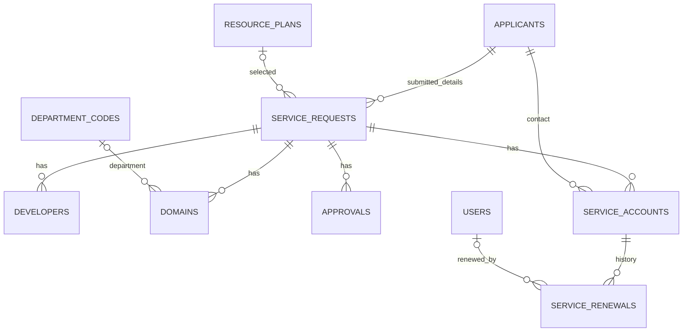

# โครงสร้างฐานข้อมูลปัจจุบัน

อ้างอิง migrations และ Models ของรุ่นส่งมอบ 10 กันยายน 2569 ไม่ใช่ SQL dump ของข้อมูลจริง รายละเอียดชนิดข้อมูลและ foreign key ให้อ้างอิงไฟล์ใน `database/migrations` เป็นหลัก

## ตารางที่ระบบใช้งาน

| ตาราง | Primary key | หน้าที่ |
|---|---|---|
| users | id | บัญชีเจ้าหน้าที่ ชื่อ อีเมล password hash และ is_active |
| password_reset_tokens | email | token รีเซ็ตรหัสผ่านของเจ้าหน้าที่ |
| applicants | applicant_id | ข้อมูลผู้ขอ ณ การยื่นคำขอใหม่แต่ละครั้ง |
| service_requests | request_id | คำขอ วัตถุประสงค์ ช่วงวันที่ สถานะ ทรัพยากรและข้อมูลประกอบ |
| developers | developer_id | ผู้รับผิดชอบพัฒนาระบบของคำขอ |
| resource_plans | plan_id | แพ็กเกจ Web Hosting / Virtual Server และราคาอ้างอิง |
| department_codes | code | รหัสหน่วยงานสำหรับข้อมูลโดเมน |
| domains | domain_id | ชื่อโดเมนในทะเบียนของคำขอ |
| approvals | approval_id | ประวัติการอนุมัติและชื่อผู้ดำเนินการ |
| service_accounts | account_id | ทะเบียนบัญชีของบริการ ไม่มีการเชื่อม Plesk |
| service_renewals | id | ประวัติต่ออายุรายบัญชี |
| failed_jobs | id | ตาราง framework ยังไม่มี workflow งาน Hosting ที่ใช้ queue |

## ความสัมพันธ์

คำขอจากฟอร์มใหม่สร้าง applicant แยกเสมอ แม้กรอกรหัสและอีเมลเดิม เพื่อไม่ให้การยื่นสาธารณะเปลี่ยนคำขอเก่า ไม่ใช่การยืนยันตัวบุคคล และไม่ควรนับจำนวน applicants เป็นจำนวนบุคคลที่ไม่ซ้ำ ข้อมูลนำเข้าเก่าอาจใช้ applicant ร่วมกันหลายคำขอ เมื่อเจ้าหน้าที่แก้คำขอที่ใช้ร่วม ระบบจะแยกข้อมูลเฉพาะคำขอนั้นและอัปเดตบัญชีของคำขอให้ตรงกัน

## service_requests

- อ้างอิง: form_no, request_date, applicant_id, source, legacy_note
- วัตถุประสงค์: purpose_type, purpose_other_detail, project_start_date, project_end_date
- สถานะ: draft/submitted/approved/rejected/expired โดยแบบฟอร์มเริ่ม submitted และเส้นทางอนุมัติยอมรับ submitted เท่านั้น
- ทรัพยากร: service_type, plan_id หรือ custom_cpu_vcpu/custom_ram_gb/custom_storage_gb/custom_fee
- บริการ: enabled_services เป็น JSON array, enabled_services_other_detail
- เทคนิค: language_framework, database_used, port_service_needed, needs_external_connection
- ไฟล์: system_detail_doc_path, screenshot_evidence_path, signature_image_path เป็น relative path
- การรับรอง: agree_to_pay, request_fee_waiver, waiver_reason, accepted, accepted_date
- ข้อมูลเดิม: receipt_no, receipt_date, receipt_time เก็บไว้เพื่ออ้างอิง ไม่ใช่สถานะรับชำระที่ตรวจสอบแล้ว รุ่นใหม่ไม่เติมค่าเหล่านี้ขณะอนุมัติ

เลขที่คำขอใหม่เป็น `REQ-000123/2569` โดยใช้ request_id เป็นลำดับ จึงไม่เริ่มนับใหม่ทุกปีและไม่คำนวณจากจำนวนแถว เลขเดิมคงไว้

## service_accounts และ service_renewals

บัญชีมี request_id, applicant_id, username (unique), password_hash, account_type, status, created_by, created_at และ expire_date ประเภทบัญชีรองรับ control_panel/ssh/database/ftp สถานะ active/disabled/expired ไม่มี last_login ใน schema หลังอัปเกรด

UI สร้างบัญชีหลักได้หนึ่งบัญชีต่อคำขอ ส่วน schema ยังยอมรับบัญชีเดิมหลายบัญชีต่อคำขอเพื่อรองรับข้อมูลเก่า ชื่อผู้สร้างอ่านจากผู้ที่ล็อกอิน ไม่รับค่าชื่อจากฟอร์มเป็นหลักฐาน

ประวัติต่ออายุมี account_id, previous_expire_date, expire_date, previous_status, renewed_by (users.id), renewed_by_name, note และ created_at การบันทึกและเปลี่ยนวันหมดอายุอยู่ใน transaction เดียวกัน พร้อม lock บัญชีและตรวจวันเดิม ป้องกันส่งฟอร์มเก่าซ้ำ

การต่ออายุ expired เปลี่ยนสถานะทะเบียนเป็น active ส่วน disabled ยังคง disabled ไม่มีการเปลี่ยน project_end_date หรือบัญชีอื่นโดยอัตโนมัติ

## การลบและข้อมูลเดิม

การลบคำขอลบบัญชี โดเมน ผู้พัฒนา ประวัติอนุมัติ และประวัติต่ออายุผ่าน foreign key cascade ไฟล์ของคำขอถูกลบเมื่อไม่มีคำขออื่นอ้างอิงแล้ว การลบบัญชีสุดท้ายของคำขอลบโดเมนที่เกี่ยวข้องด้วย ยังไม่มี soft delete หรือกู้คืนในหน้าเว็บ

ตาราง request_resources, request_enabled_services, tech_details, attachments, fee_certifications และ policy_acceptances ถูกรวมเข้า service_requests แล้ว ส่วน roles/permissions/role_user/permission_role อาจยังอยู่ในฐานข้อมูลเดิม แต่ไม่จำเป็นสำหรับการติดตั้งใหม่และไม่มีการบังคับสิทธิ์ผ่านตารางเหล่านี้

## ข้อควรทราบในการพัฒนาต่อ

- ฐานข้อมูลใช้งานจริงที่รองรับในชุดส่งมอบคือ MySQL/MariaDB; SQLite ใช้สร้างฐานข้อมูลใหม่สำหรับ tests เท่านั้น
- Migration เก่าที่ถอดและคืน applicant_id ข้ามขั้นตอนถอดชั่วคราวบน SQLite เพื่อหลีกเลี่ยงข้อจำกัด foreign key ของ SQLite
- approvals.approver_level เพิ่ม staff สำหรับการอนุมัติชั้นเดียวโดยเจ้าหน้าที่ ค่าเดิมของข้อมูลเก่าไม่ถูกเปลี่ยน
- timestamps ใช้ timezone จาก config/app.php ซึ่งรุ่นนี้เป็น UTC ส่วนวันที่บริการเป็นวันปฏิทิน ไม่มีการแปลงข้อมูลเก่าย้อนหลัง
- การ rollback migrations เก่าบางรายการไม่สามารถประกอบตารางที่รวมไปแล้วกลับได้ ส่วน snapshots และระดับอนุมัติใหม่ป้องกัน downgrade ที่อาจทำประวัติสูญหาย ให้กู้ฐานข้อมูลและโค้ดจาก backup ชุดเดียวกัน
